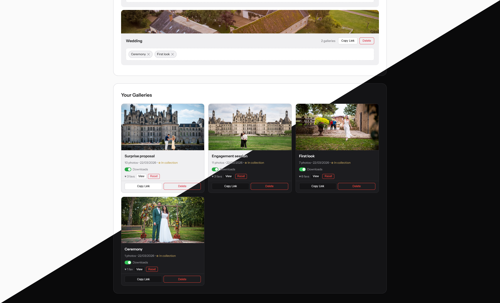

<div align="center">
  
</div>

# Delyvr

A self-hosted photo delivery platform for photographers. Upload photos, share a branded download link with your client — they get a beautiful gallery preview and a one-click ZIP download.

> Based on the original work of [Andre Padua (apadua)](https://github.com/apadua/MeTransfer). Thank you for the foundation.

---

## ⚠️ Security Notice

This application has been coded with the help of AI and is provided as-is. While reasonable security measures have been implemented (see the Security section below), no independent audit has been performed. You are responsible for reviewing the code, assessing the risks for your use case, and validating that the deployment meets your security requirements before exposing this to the internet. The repository owner accepts no liability for any damages or data loss resulting from the use of this software.

---

## Features

- **Drag & Drop Upload** — drop individual files or entire folders from your computer
- **Custom Backgrounds** — upload a hero image per gallery; stored as normalised JPEG
- **Photo Preview Page** — masonry grid with full-screen lightbox, keyboard/touch navigation, and individual photo download. Photos display at their natural aspect ratio.
- **Fast Lightbox** — 1920px previews generated automatically at upload time and served in the lightbox; originals are only transferred on explicit download. Adjacent photos are preloaded in the background for instant navigation.
- **Clean Lightbox** — download and favorite buttons on desktop; a persistent bottom action bar (Prev / Fav / Close / Save / Next) on mobile with swipe support.
- **ZIP Downloads** — all photos packaged into a single named download
- **Download Toggle** — enable or disable downloads per gallery from the dashboard
- **Client Favorites** — clients can heart photos from the grid or the lightbox; each visitor is tracked anonymously so multiple people can vote independently; the admin sees vote counts sorted descending with a reset option
- **Collections** — group multiple galleries under a single shareable link. Each collection can have its own cover image. Clients can browse and download each gallery individually or download the entire collection as a ZIP with one sub-folder per gallery.
- **Back to Collection** — when a client reaches a gallery via a collection link, a back button appears in the navigation bar. Direct gallery links show nothing.
- **Gallery Grid View** — the admin dashboard displays galleries as a visual card grid with 16/9 cover images
- **Light / Dark Mode** — toggle from the admin dashboard; applies site-wide to all visitors immediately and persists across restarts
- **Social Links & Website** — set your website URL and social network links from the admin dashboard (Profile modal); displayed as icons in the footer of all client pages
- **Right-Click Protection** — browser context menu disabled on images across all client pages
- **Gallery Management** — rename inline, set cover images, copy links, delete
- **Custom Logo** — upload your own logo; shown on all pages; revert to default anytime
- **Social Media Previews** — auto-generated OG images (1200×630) injected into share links
- **Multi-Language Support** — client pages auto-detect browser language; supports English, French, Spanish, Portuguese, and Italian
- **Mobile Responsive** — all client pages adapt to small screens; the customer page is fully fixed (no scroll)
- **No Database Required** — file-based storage, simple to deploy and back up

---

## Screenshots

### Admin Dashboard



### Gallery Created


### Client Download Page


### Client Photo Preview


---

## Quick Start (Docker Compose)

This is the recommended installation method. You only need Docker installed.

### 1. Create a project directory

```bash
mkdir delyvr && cd delyvr
```

### 2. Create your `docker-compose.yml`

```yaml
services:
  delyvr:
    image: tiritibambix/delyvr:main-latest
    restart: unless-stopped
    ports:
      - "${PORT:-3000}:3000"
    environment:
      - INSTALL_DIR=/data
      - ADMIN_PASSWORD=${ADMIN_PASSWORD}
      - MAX_UPLOAD_MB=${MAX_UPLOAD_MB:-200}
      - MAX_BACKGROUND_MB=${MAX_BACKGROUND_MB:-20}
      - TRUST_PROXY=${TRUST_PROXY:-1}
      # Optional: restrict admin access to specific IPs or CIDR ranges
      # Leave unset to allow all IPs (default)
      # - ADMIN_ALLOWED_IPS=88.123.45.67,192.168.1.0/24
    volumes:
      - ${GALLERY_DIR:-./data}:/data
```

### 3. Start the container

```bash
docker compose up -d
```

Delyvr is now running at `http://localhost:3000`. Gallery data is stored in `./data/` and persists across container restarts and upgrades.

### Updating

```bash
docker compose pull && docker compose up -d
```

---

## Configuration

All settings live in your `docker-compose.yml` environment block (or in a `.env` file for bare-metal installs). Never commit passwords to version control.

| Variable | Default | Description |
|----------|---------|-------------|
| `ADMIN_PASSWORD` | *(required)* | Password to access the admin dashboard. Use a long random string. |
| `PORT` | `3000` | TCP port the server listens on |
| `MAX_UPLOAD_MB` | `200` | Max size per photo file, in MB |
| `MAX_BACKGROUND_MB` | `20` | Max size for background images, in MB |
| `INSTALL_DIR` | *(project dir)* | Set to `/data` in Docker. Do not change. |
| `TRUST_PROXY` | `0` | Set to `1` when running behind a reverse proxy (Nginx, Caddy, Traefik). Enables correct client IP detection for rate limiting. |
| `ADMIN_ALLOWED_IPS` | *(unset — all IPs allowed)* | Comma-separated list of IPs or CIDR ranges allowed to access admin routes. Example: `88.123.45.67,192.168.1.0/24`. When unset, no IP restriction is applied. |

---

## Security

The following measures are implemented in the codebase:

**Authentication & access control**
- Admin password verified via `X-Admin-Password` header only — never via query string, never stored in sessionStorage
- Login endpoint rate-limited to 10 attempts per IP per 15 minutes
- Optional IP allowlist (`ADMIN_ALLOWED_IPS`) supporting individual IPs and CIDR ranges, applied to all admin routes including the login endpoint
- All admin route failures and blocked IP attempts are logged to stdout with an `[AUTH]` prefix, visible via `docker logs`

**Input validation & path safety**
- All filesystem paths incorporating user-controlled values go through `safeResolvePath()`, which resolves and verifies the path stays within the allowed base directory
- Gallery and collection IDs validated as UUID v4 before any filesystem operation
- Filenames validated against a strict allowlist pattern
- All `req.body` parameters type-checked before use

**Output sanitisation**
- HTML escaping via the `escape-html` package on all OG tag injections

**Rate limiting**

| Limiter | Limit | Applied to |
|---------|-------|------------|
| `authLimiter` | 10 / 15 min | Login endpoint |
| `imageLimiter` | 600 / min | Photo and OG image serving |
| `publicReadLimiter` | 300 / min | All public GET routes |
| `publicWriteLimiter` | 120 / min | Favorites toggle |
| `downloadLimiter` | 10 / min | ZIP downloads |
| `adminLimiter` | 60 / min | Admin routes with filesystem access |

**What is not covered**
- Gallery links are public by design — anyone with the UUID can access photos. UUIDs are not guessable but are not secret if the link is forwarded.
- There is no HTTPS at the application level — you must terminate SSL at your reverse proxy.
- There is no multi-user or per-gallery password system.

---

## Usage

1. **Open the Dashboard** — go to `http://localhost:3000`
2. **Log in** — enter your admin password
3. **Enter an Event Name** — e.g. "Johnson Wedding" or "Senior Photos - Sarah"
4. **Upload Photos** — drag and drop files or entire folders onto the upload zone
5. **Add a Background** *(optional)* — upload a hero image shown on the client page
6. **Create Gallery** — click "Create Gallery & Get Link"
7. **Share** — copy the generated link and send it to your client

### Collections

Collections group multiple galleries under a single shareable link. The typical use case is one collection per wedding, with one gallery per key moment (getting ready, ceremony, cocktail, dinner...).

**Creating a collection:**
1. In the Collections section of the dashboard, type a name and click **+ New Collection**
2. Optionally add a cover image by clicking or dropping a photo onto the collection cover zone
3. Drag gallery cards from the gallery grid into the collection's drop zone
4. Drag pills within the collection to reorder galleries in chronological order
5. Copy the collection link and share it with your client

A gallery can belong to only one collection. Deleting a collection does not delete the galleries.

### Social links

Open the **Profile** modal from the top-left button in the admin header. Enter your website URL and any social network URLs you want displayed. Only filled fields appear in the footer of client pages. Leave a field empty to hide that icon.

### Download toggle

Each gallery has a **Downloads** toggle. When disabled, ZIP and individual photo download endpoints return 403. The gallery remains fully browsable — useful for draft galleries where you want clients to make a selection first.

### Client favorites

Clients can heart photos from the grid or the lightbox. Each device gets a stable anonymous ID so multiple people can vote independently. From the admin dashboard, click **View** on a gallery to see photos sorted by vote count, then **Reset** to clear all votes.

### Light / Dark mode

The theme toggle in the admin header applies the change immediately to all pages for every visitor. The choice persists across restarts.

---

## Deployment

### Behind Nginx (free SSL with Let's Encrypt)

```bash
sudo apt install -y nginx certbot python3-certbot-nginx
sudo nano /etc/nginx/sites-available/delyvr
```

Paste:

```nginx
server {
    listen 80;
    server_name photos.yourdomain.com;

    location / {
        proxy_pass http://localhost:3000;
        proxy_http_version 1.1;
        proxy_set_header Upgrade $http_upgrade;
        proxy_set_header Connection 'upgrade';
        proxy_set_header Host $host;
        proxy_set_header X-Real-IP $remote_addr;
        proxy_set_header X-Forwarded-For $proxy_add_x_forwarded_for;
        proxy_set_header X-Forwarded-Proto $scheme;
        proxy_cache_bypass $http_upgrade;
        client_max_body_size 500M;
    }
}
```

```bash
sudo ln -s /etc/nginx/sites-available/delyvr /etc/nginx/sites-enabled/
sudo nginx -t && sudo systemctl reload nginx
sudo certbot --nginx -d photos.yourdomain.com
```

Set `TRUST_PROXY=1` in your compose file so rate limiting uses the real client IP.

---

## Manual Installation (bare-metal, no Docker)

### 1. Install Node.js

```bash
curl -o- https://raw.githubusercontent.com/nvm-sh/nvm/v0.39.7/install.sh | bash
source ~/.bashrc
nvm install 20 && nvm use 20
```

### 2. Clone and install

```bash
cd /opt
sudo git clone https://github.com/tiritibambix/delyvr.git
sudo chown -R $USER:$USER /opt/delyvr
cd delyvr
npm install
```

### 3. Configure

```bash
cp .env.example .env && nano .env
```

Set at minimum:

```
ADMIN_PASSWORD=your_secure_password_here
```

### 4. Start

```bash
npm start
```

### Keep it running with PM2

```bash
npm install -g pm2
pm2 start server.js --name delyvr
pm2 save && pm2 startup
```

---

## File Structure

```
delyvr/
├── server.js           # Express server — all routes and middleware
├── package.json
├── Dockerfile
├── docker-compose.yml
├── .env                # Your config (gitignored)
├── .env.example        # Template for new installs
├── public/
│   ├── admin.html      # Photographer dashboard
│   ├── customer.html   # Client download page
│   ├── preview.html    # Photo browser — masonry grid + lightbox
│   ├── collection.html # Client collection page
│   └── logo.svg        # Default logo
└── data/               # Runtime data (Docker volume mount)
    ├── uploads/        # Gallery photos, organised by gallery ID
    ├── backgrounds/    # Background images (JPEG)
    ├── thumbnails/     # 400px JPEG thumbnails, auto-generated
    ├── previews/       # 1920px JPEG lightbox previews, auto-generated
    ├── og-cache/       # 1200×630 OG images, generated on first share
    ├── logo.*          # Custom logo if uploaded
    ├── galleries.json
    ├── collections.json
    └── settings.json   # Theme + social links — created automatically
```

---

## API Reference

### Gallery endpoints

| Method | Endpoint | Auth | Description |
|--------|----------|------|-------------|
| `GET` | `/` | — | Admin dashboard |
| `GET` | `/download/:id` | — | Client download page |
| `GET` | `/preview/:id` | — | Photo preview page |
| `POST` | `/api/auth/verify` | — | Verify admin password |
| `POST` | `/api/gallery/create` | ✓ | Create gallery and upload photos |
| `POST` | `/api/gallery/:id/upload` | ✓ | Add photos to existing gallery |
| `POST` | `/api/gallery/:id/background` | ✓ | Upload/replace background image |
| `POST` | `/api/gallery/:id/rename` | ✓ | Rename a gallery |
| `PATCH` | `/api/gallery/:id/downloads` | ✓ | Enable or disable downloads |
| `GET` | `/api/gallery/:id/info` | — | Gallery metadata |
| `GET` | `/api/gallery/:id/photos` | — | Photo list with URLs |
| `GET` | `/api/gallery/:id/photo/:filename` | — | Serve photo; `?thumb=1` for 400px thumbnail |
| `GET` | `/api/gallery/:id/preview/:filename` | — | Serve 1920px lightbox preview |
| `GET` | `/api/gallery/:id/download` | — | ZIP download |
| `GET` | `/api/gallery/:id/download/:filename` | — | Single photo download |
| `GET` | `/api/gallery/:id/background` | — | Serve background image |
| `GET` | `/api/gallery/:id/og-image` | — | Serve/generate OG image |
| `POST` | `/api/gallery/:id/favorites` | — | Toggle a photo favorite |
| `GET` | `/api/gallery/:id/favorites-public` | — | Visitor's favorites |
| `GET` | `/api/gallery/:id/favorites` | ✓ | All favorites sorted by votes (admin) |
| `DELETE` | `/api/gallery/:id/favorites` | ✓ | Reset all favorites |
| `GET` | `/api/galleries` | ✓ | List all galleries |
| `DELETE` | `/api/gallery/:id` | ✓ | Delete a gallery |

### Collection endpoints

| Method | Endpoint | Auth | Description |
|--------|----------|------|-------------|
| `GET` | `/collection/:id` | — | Client collection page |
| `POST` | `/api/collection/create` | ✓ | Create a collection |
| `GET` | `/api/collections` | ✓ | List all collections (admin) |
| `GET` | `/api/collection/:id` | — | Collection info with galleries (public) |
| `POST` | `/api/collection/:id/rename` | ✓ | Rename |
| `POST` | `/api/collection/:id/background` | ✓ | Upload/replace cover image |
| `GET` | `/api/collection/:id/background` | — | Serve cover image |
| `POST` | `/api/collection/:id/galleries` | ✓ | Add gallery to collection |
| `PATCH` | `/api/collection/:id/galleries/reorder` | ✓ | Reorder galleries |
| `DELETE` | `/api/collection/:id/galleries/:galleryId` | ✓ | Remove gallery from collection |
| `GET` | `/api/collection/:id/download` | — | ZIP all galleries |
| `DELETE` | `/api/collection/:id` | ✓ | Delete collection (galleries kept) |

### Settings endpoints

| Method | Endpoint | Auth | Description |
|--------|----------|------|-------------|
| `GET` | `/api/settings` | — | Get site settings (theme, social links) |
| `POST` | `/api/settings` | ✓ | Update theme, website, and social links |
| `PATCH` | `/api/settings/theme` | ✓ | Update theme only |

Authenticated endpoints require the `X-Admin-Password` header.

---

## Tips

- **Branding** — use a photo from the same session as the background for a cohesive look
- **File names** — rename files on your camera before uploading; the original names control sort order
- **Gallery covers** — always upload a cover; it's the main visual identifier in the grid and on the collection page
- **Collections workflow** — create one collection per event, drag galleries into it in chronological order, share the collection link
- **Draft workflow** — create the gallery with downloads disabled, share for client selection, enable downloads when ready
- **Disk space** — delete galleries once clients have downloaded; `uploads/` and `previews/` can grow large
- **Link expiry** — there is no automatic expiry; delete a gallery from the dashboard when done

---

## Troubleshooting

### Upload fails for large batches

```bash
NODE_OPTIONS="--max-old-space-size=4096" npm start
```

### Nginx returns 413 Request Entity Too Large

Add to your Nginx config: `client_max_body_size 500M;` then `sudo systemctl reload nginx`.

### Downloads time out on very large galleries

Split into multiple galleries, or add `proxy_read_timeout 300;` to your Nginx config.

### Server won't start — "ADMIN_PASSWORD is not set"

```bash
cp .env.example .env && nano .env
```

### Admin access blocked unexpectedly

If `ADMIN_ALLOWED_IPS` is set, check `docker logs delyvr` for `[AUTH]` entries showing which IP was blocked. Add your IP to the allowlist or clear the variable to disable the restriction.

---

## License

MIT — free to use and modify for your photography business.