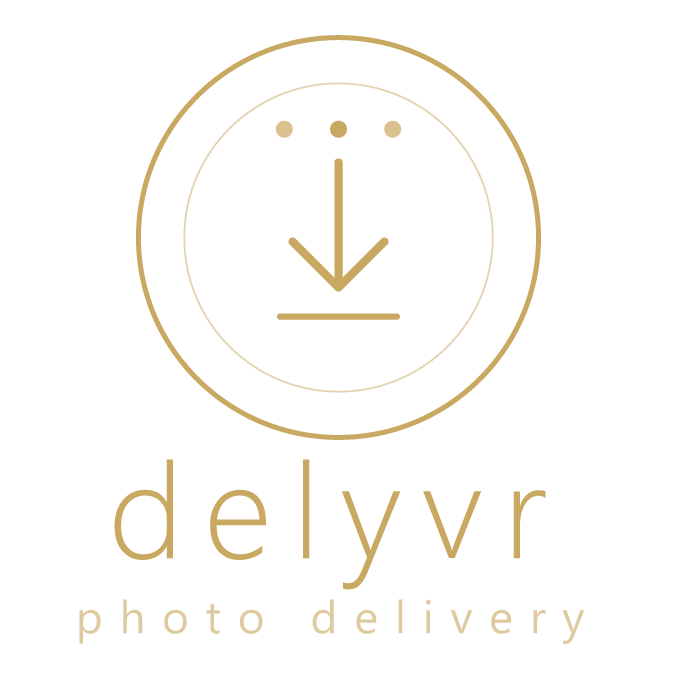
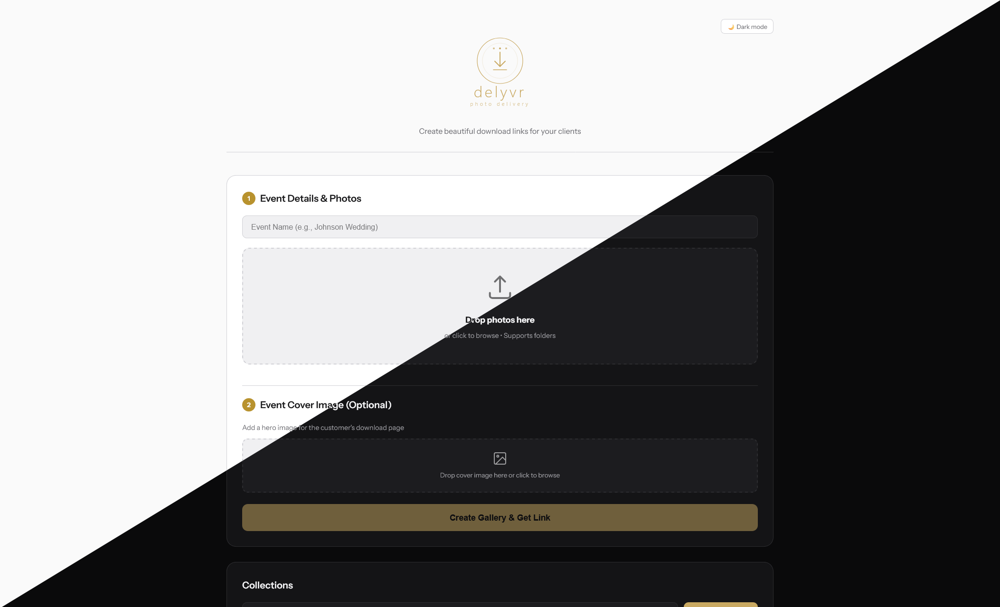
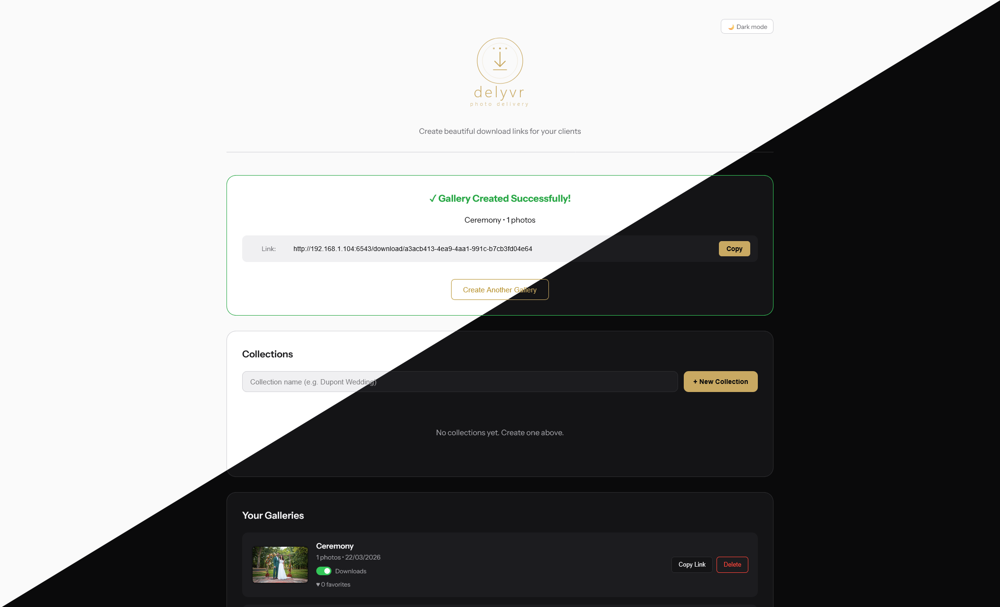

<div align="center">
  
</div>

# Delyvr

A self-hosted photo delivery platform for photographers. Upload photos, share a branded download link with your client - they get a beautiful gallery preview and a one-click ZIP download.

> Based on the original work of [Andre Padua (apadua)](https://github.com/apadua/MeTransfer). Thank you for the foundation.

---

## Features

- **Drag & Drop Upload** - drop individual files or entire folders from your computer
- **Custom Backgrounds** - upload a hero image per gallery; stored as normalised JPEG
- **Photo Preview Page** - masonry grid with full-screen lightbox, keyboard/touch navigation, and individual photo download. Photos display at their natural aspect ratio.
- **Clean Lightbox** - download and favorite buttons discreetly placed next to the close button, giving full space to the photo
- **ZIP Downloads** - all photos packaged into a single named download
- **Download Toggle** - enable or disable downloads per gallery from the dashboard; useful for draft galleries or contact sheets
- **Client Favorites** - clients can heart photos from the grid or the lightbox; each visitor is tracked anonymously so multiple people can vote independently; the admin sees vote counts per photo sorted from most to least voted, with a reset option
- **Collections** - group multiple galleries under a single shareable link (e.g. one collection per wedding, one gallery per key moment). Clients can browse and download each gallery individually or download the entire collection as a single ZIP with one sub-folder per gallery
- **Right-Click Protection** - browser context menu is disabled on images across all client pages to prevent casual saving
- **Gallery Management** - rename galleries inline, set cover images, copy links, delete from the dashboard
- **Custom Logo** - upload your own logo from the dashboard; shown on both admin and client pages; revert to default anytime
- **Social Media Previews** - auto-generated OG images (1200×630) injected into share links
- **Multi-Language Support** - client pages auto-detect browser language; supports English, Portuguese, Spanish, Italian, and French
- **No Database Required** - file-based storage, simple to deploy and back up

---

## Screenshots

### Admin Dashboard


### Gallery Created


### Client Download Page


### Client Photo Preview


---

## Quick Start (Docker Compose)

This is the recommended installation method. You only need Docker installed.

### 1. Create a project directory

```bash
mkdir delyvr && cd delyvr
```

### 2. Create your `docker-compose.yml`

```yaml
services:
  delyvr:
    image: tiritibambix/delyvr:main-latest
    restart: unless-stopped
    ports:
      - "3000:3000"
    environment:
      - INSTALL_DIR=/data # Needed for container deployment. Do not change this value.
      - ADMIN_PASSWORD=STRONGPASSWORD
      - MAX_UPLOAD_MB=${MAX_UPLOAD_MB:-200}
      - MAX_BACKGROUND_MB=${MAX_BACKGROUND_MB:-20}
      - TRUST_PROXY=0
    volumes:
      - ./data:/data
```

### 3. Start the container

```bash
docker compose up -d
```

Delyvr is now running at `http://localhost:3000`. Gallery data is stored in `./data/` and persists across container restarts and upgrades.

### Updating

```bash
docker compose pull && docker compose up -d
```

---

## Configuration

All settings live in your `docker-compose.yml` environment block (or in a `.env` file for bare-metal installs). Never commit passwords to version control.

| Variable | Default | Description |
|----------|---------|-------------|
| `ADMIN_PASSWORD` | *(required)* | Password to access the admin dashboard |
| `PORT` | `3000` | TCP port the server listens on |
| `MAX_UPLOAD_MB` | `200` | Max size per photo file, in MB |
| `MAX_BACKGROUND_MB` | `20` | Max size for background images, in MB |
| `INSTALL_DIR` | *(project dir)* | Set to `/data` in Docker. Do not change. |
| `TRUST_PROXY` | `0` | Set to `1` when running behind a reverse proxy (Nginx, Caddy, Traefik). Enables correct client IP detection for rate limiting and HTTPS detection. |

---

## Usage

1. **Open the Dashboard** - go to `http://localhost:3000`
2. **Log in** - enter your admin password
3. **Enter an Event Name** - e.g. "Johnson Wedding" or "Senior Photos - Sarah"
4. **Upload Photos** - drag and drop files or entire folders onto the upload zone
5. **Add a Background** *(optional)* - upload a hero image shown on the client page
6. **Create Gallery** - click "Create Gallery & Get Link"
7. **Share** - copy the generated link and send it to your client

### Collections

Collections group multiple galleries under a single shareable link. The typical use case is one collection per wedding, with one gallery per key moment (getting ready, ceremony, cocktail, dinner...).

**Creating a collection:**
1. In the Collections section of the dashboard, type a name and click **+ New Collection**
2. Drag gallery items from the gallery list into the collection's drop zone
3. Drag pills within the collection to reorder galleries in chronological order
4. Copy the collection link and share it with your client

**What the client sees on the collection page:**
- All galleries as cards with cover image, name, and photo count
- Clicking a cover browses the gallery
- A **Copy Link** button per gallery to share individual galleries
- A **Download** button per gallery (if downloads are enabled)
- A **Download All Galleries** button that downloads a single ZIP with one sub-folder per gallery

A gallery can belong to only one collection. Deleting a collection does not delete the galleries — they remain accessible individually.

### Download toggle

Each gallery in the dashboard has a **Downloads** toggle. When disabled:
- The download button is hidden on the client pages
- ZIP and individual photo download endpoints return 403
- The gallery remains fully browsable - clients can view all photos in the lightbox

This is useful for draft galleries where you want clients to make a selection before you deliver the final files.

### Client favorites

Clients can heart photos directly from the gallery grid or the lightbox. Each device gets a stable anonymous ID so multiple people (family members, a couple) can vote independently without overwriting each other.

From the admin dashboard, each gallery shows a favorite count. Clicking **View** opens a modal with favorited photos sorted by vote count descending, with a ♥ N badge on each thumbnail. **Reset** clears all votes.

Two concrete use cases:
- **Portrait / couples sessions** - share a draft gallery, let the client pick the photos they want retouched. Favorites replace the back-and-forth of emails and filename lists.
- **Weddings** - ask clients which photos they loved most after delivery. Opens the door to offering prints.

### What your client sees

When your client opens a gallery link they see:
- Your custom background image (if uploaded)
- The event name as the page title
- A **"Browse Photos"** button that opens a masonry grid with a full-screen lightbox and individual download
- A **"Download All"** button - all photos arrive as one ZIP file (if downloads are enabled)
- A heart button on each photo and in the lightbox to mark favorites

---

## Deployment

### Behind Nginx (free SSL with Let's Encrypt)

Install Nginx and Certbot:

```bash
sudo apt install -y nginx certbot python3-certbot-nginx
```

Create a site config:

```bash
sudo nano /etc/nginx/sites-available/delyvr
```

Paste:

```nginx
server {
    listen 80;
    server_name photos.yourdomain.com;

    location / {
        proxy_pass http://localhost:3000;
        proxy_http_version 1.1;
        proxy_set_header Upgrade $http_upgrade;
        proxy_set_header Connection 'upgrade';
        proxy_set_header Host $host;
        proxy_set_header X-Real-IP $remote_addr;
        proxy_set_header X-Forwarded-For $proxy_add_x_forwarded_for;
        proxy_set_header X-Forwarded-Proto $scheme;
        proxy_cache_bypass $http_upgrade;

        # Required for large photo uploads
        client_max_body_size 500M;
    }
}
```

Enable and reload:

```bash
sudo ln -s /etc/nginx/sites-available/delyvr /etc/nginx/sites-enabled/
sudo nginx -t
sudo systemctl reload nginx
```

Get a free SSL certificate:

```bash
sudo certbot --nginx -d photos.yourdomain.com
```

Certbot will automatically renew the certificate. Delyvr is now accessible at `https://photos.yourdomain.com`.

Make sure `TRUST_PROXY=1` is set so that rate limiting and HTTPS detection use the real client IP and protocol rather than the proxy's.

---

## Manual Installation (bare-metal, no Docker)

### 1. Install Node.js

The recommended approach is [nvm](https://github.com/nvm-sh/nvm):

```bash
curl -o- https://raw.githubusercontent.com/nvm-sh/nvm/v0.39.7/install.sh | bash
source ~/.bashrc          # or ~/.zshrc if you use zsh
nvm install 20
nvm use 20
node -v                   # should print v20.x.x
```

Alternatively, using apt (Ubuntu/Debian):

```bash
curl -fsSL https://deb.nodesource.com/setup_20.x | sudo -E bash -
sudo apt-get install -y nodejs
node -v
```

### 2. Clone the repository

```bash
cd /opt
sudo git clone https://github.com/tiritibambix/delyvr.git
sudo chown -R $USER:$USER /opt/delyvr
cd delyvr
```

### 3. Install dependencies

```bash
npm install
```

### 4. Configure environment

```bash
cp .env.example .env
nano .env
```

Set at minimum:

```
ADMIN_PASSWORD=your_secure_password_here
```

Save and exit (`Ctrl+O`, `Enter`, `Ctrl+X` in nano).

### 5. Start the server

```bash
npm start
```

The server starts at `http://localhost:3000`.

### Keep it running with PM2

PM2 keeps the process alive across reboots:

```bash
npm install -g pm2
pm2 start server.js --name delyvr
pm2 save
pm2 startup   # follow the printed command
```

To check logs:

```bash
pm2 logs delyvr
```

---

## File Structure

```
delyvr/
├── server.js           # Express server - all routes and middleware
├── package.json        # Dependencies
├── Dockerfile
├── docker-compose.yml
├── .env                # Your config (gitignored - never committed)
├── .env.example        # Template for new installs
├── public/
│   ├── admin.html      # Photographer dashboard
│   ├── customer.html   # Client download page
│   ├── preview.html    # Photo browser - masonry grid + lightbox
│   ├── collection.html # Client collection page
│   └── logo.svg        # Default logo (replaced at runtime by a custom upload)
└── data/               # Runtime data (Docker volume mount)
    ├── uploads/        # Gallery photos, organised by gallery ID
    ├── backgrounds/    # Background images, one per gallery (JPEG)
    ├── thumbnails/     # 400px preview thumbnails, generated automatically
    ├── og-cache/       # 1200×630 OG images, generated on first share
    ├── logo.*          # Custom logo if uploaded (overrides logo.svg)
    ├── galleries.json  # Gallery metadata
    └── collections.json # Collection metadata
```

`data/` and its contents are gitignored - they contain user data, not source code.

---

## API Reference

### Gallery endpoints

| Method | Endpoint | Auth | Description |
|--------|----------|------|-------------|
| `GET` | `/` | - | Admin dashboard |
| `GET` | `/download/:id` | - | Client download page (with OG meta tags) |
| `GET` | `/preview/:id` | - | Photo preview page (with OG meta tags) |
| `POST` | `/api/auth/verify` | - | Verify admin password |
| `POST` | `/api/gallery/create` | ✓ | Create gallery and upload photos |
| `POST` | `/api/gallery/:id/upload` | ✓ | Add photos to existing gallery |
| `POST` | `/api/gallery/:id/background` | ✓ | Upload/replace background image |
| `POST` | `/api/gallery/:id/rename` | ✓ | Rename a gallery |
| `PATCH` | `/api/gallery/:id/downloads` | ✓ | Enable or disable downloads (`{ "enabled": true\|false }`) |
| `GET` | `/api/gallery/:id/info` | - | Gallery metadata (includes `downloadsEnabled`) |
| `GET` | `/api/gallery/:id/photos` | - | List photos with URLs (used by preview page) |
| `GET` | `/api/gallery/:id/photo/:filename` | - | Serve photo; add `?thumb=1` for 400px thumbnail |
| `GET` | `/api/gallery/:id/download` | - | Download all photos as ZIP (403 if downloads disabled) |
| `GET` | `/api/gallery/:id/download/:filename` | - | Download a single photo (403 if downloads disabled) |
| `GET` | `/api/gallery/:id/background` | - | Serve background image |
| `GET` | `/api/gallery/:id/og-image` | - | Serve/generate 1200×630 OG image |
| `POST` | `/api/gallery/:id/favorites` | - | Toggle a photo favorite for a visitor (`{ filename, visitorId }`) |
| `GET` | `/api/gallery/:id/favorites-public` | - | Get this visitor's favorites (`?visitorId=`) |
| `GET` | `/api/gallery/:id/favorites` | ✓ | List all favorites sorted by vote count (admin) |
| `DELETE` | `/api/gallery/:id/favorites` | ✓ | Reset all favorites for a gallery |
| `GET` | `/api/galleries` | ✓ | List all galleries |
| `DELETE` | `/api/gallery/:id` | ✓ | Delete a gallery |

### Collection endpoints

| Method | Endpoint | Auth | Description |
|--------|----------|------|-------------|
| `GET` | `/collection/:id` | - | Client collection page (with OG meta tags) |
| `POST` | `/api/collection/create` | ✓ | Create a collection (`{ name }`) |
| `GET` | `/api/collections` | ✓ | List all collections (admin) |
| `GET` | `/api/collection/:id` | - | Collection info with galleries (public) |
| `POST` | `/api/collection/:id/rename` | ✓ | Rename a collection |
| `POST` | `/api/collection/:id/galleries` | ✓ | Add a gallery to a collection (`{ galleryId }`) |
| `PATCH` | `/api/collection/:id/galleries/reorder` | ✓ | Reorder galleries (`{ galleryIds: [...] }`) |
| `DELETE` | `/api/collection/:id/galleries/:galleryId` | ✓ | Remove a gallery from a collection |
| `GET` | `/api/collection/:id/download` | - | Download all galleries as ZIP (one sub-folder per gallery) |
| `DELETE` | `/api/collection/:id` | ✓ | Delete a collection (galleries are NOT deleted) |

Authenticated endpoints require the `X-Admin-Password` header.

---

## Tips

- **Branding** - use a photo from the same session as the background for a cohesive look
- **File names** - rename files on your camera before uploading; the original names are preserved and used for sort order
- **Collections workflow** - create one collection per event, drag galleries into it in chronological order, share the collection link with your client
- **Draft workflow** - create the gallery with downloads disabled, share the link for client selection, then enable downloads once the final files are ready
- **Favorites workflow** - for weddings, share the gallery after the event and let clients heart their favorites before offering prints
- **Disk space** - delete galleries once clients have downloaded; `uploads/` can grow large
- **Link expiry** - there is no automatic expiry; delete a gallery from the dashboard when done

---

## Troubleshooting

### Upload fails for large batches

Increase the Node.js heap size:

```bash
NODE_OPTIONS="--max-old-space-size=4096" npm start
```

### Nginx returns 413 Request Entity Too Large

Add or increase `client_max_body_size` in your Nginx config:

```nginx
client_max_body_size 500M;
```

Then reload Nginx: `sudo systemctl reload nginx`

### Downloads time out on very large galleries

- Split the session into multiple galleries
- Increase the proxy timeout in Nginx: `proxy_read_timeout 300;`

### Server won't start - "ADMIN_PASSWORD is not set"

Make sure `ADMIN_PASSWORD` is set in your environment or `.env` file:

```bash
cp .env.example .env
nano .env
```

---

## License

MIT - free to use and modify for your photography business.