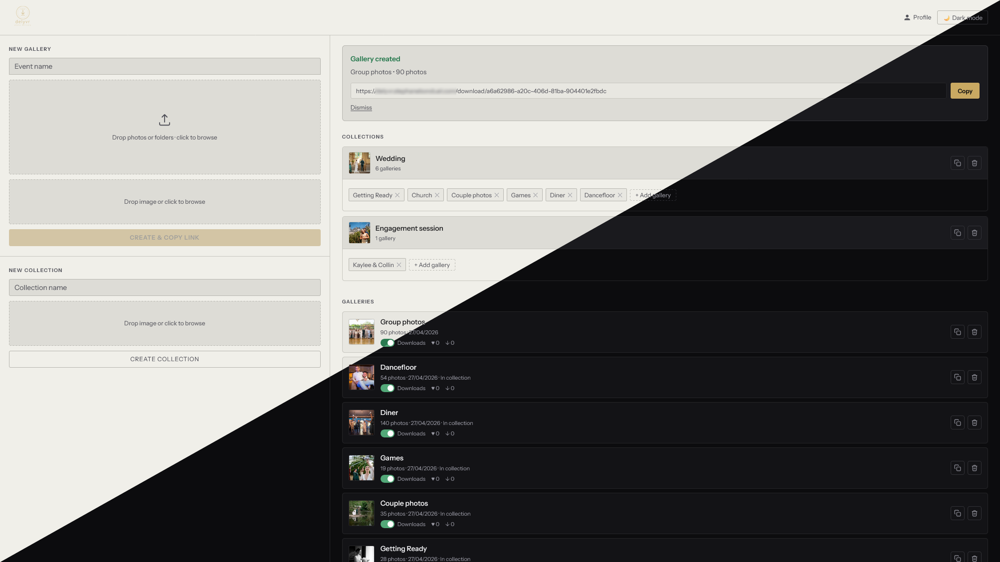
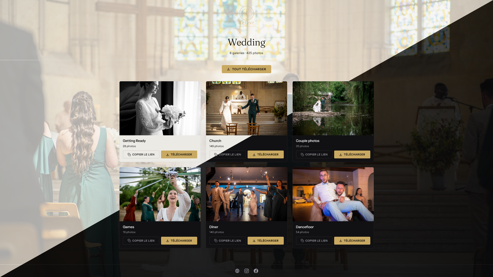
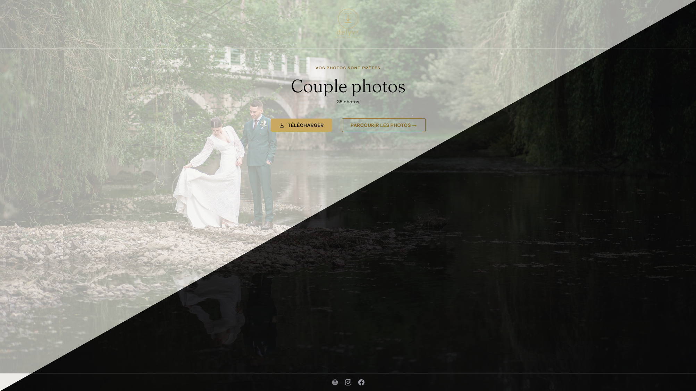
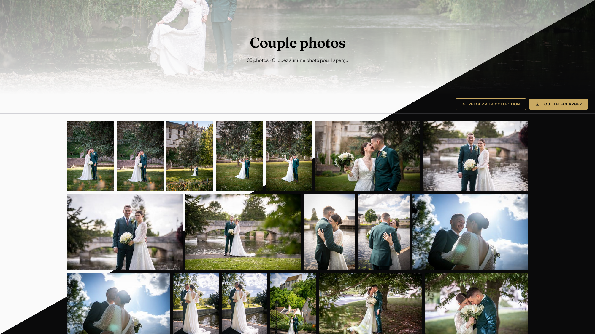

<div align="center">
  
</div>

# Delyvr

Delyvr is a self-hosted photo delivery platform built for photographers. You upload your photos, and your clients get a beautiful, fast, mobile-friendly gallery where they can browse, mark their favorites, and download everything with one click.

No monthly subscription. No watermarks. No cloud service that might disappear or raise its prices. Just your server, your galleries, your brand.

> Based on the original work of [Andre Padua (apadua)](https://github.com/apadua/MeTransfer). Thank you for the foundation.

---

## ⚠️ Security Notice

This application was built with the help of AI and is provided as-is. Reasonable security measures have been implemented (see the [Security](https://github.com/Tiritibambix/Delyvr#security) section), but no independent audit has been performed. You are responsible for reviewing the code and validating that the deployment meets your requirements before exposing it to the internet. The repository owner accepts no liability for any damages or data loss resulting from the use of this software.

---

## Screenshots

### Admin Dashboard


### Collection


### Client Download Page


### Client Photo Preview


---

## What your clients experience

When you share a gallery link with a client, here is what they get:

**On desktop:** A full justified grid of photos that fills the screen beautifully. Clicking any photo opens a full-screen lightbox with keyboard navigation (arrow keys, Escape). They can mark their favorites with a heart, download individual photos, or grab everything as a ZIP with one click. The ZIP filename keeps accents and special characters exactly as you named the files.

**On mobile:** The same gallery, fully optimised for touch. Swipe left and right to navigate between photos in the lightbox. Pinch with two fingers to zoom in up to 5x, then drag with one finger to pan. Tap to show or hide the action bar. Nothing breaks, nothing is hidden.

**Collections:** If you group galleries into a collection (useful for multi-part events like weddings), your client lands on a page showing all galleries with their cover images and photo counts. They can download everything at once or dive into individual galleries. They can also share the link to a specific gallery with friends or family who only need to see that part of the event.

**Favorites:** Clients can heart the photos they love, from the grid or inside the lightbox. Each person gets their own anonymous vote, so multiple people reviewing the same gallery don't overwrite each other's picks. You see the results sorted by vote count in your dashboard.

**Language:** The client pages automatically detect the browser language and display in English, French, Spanish, Portuguese, or Italian.

**Branding:** Your logo appears on every page. Your Instagram, website, and other social links appear in the footer. The whole thing looks like yours.

---

## What you get as the photographer

### The dashboard

The admin dashboard is designed to work well on both desktop and mobile. On a computer you get a two-column layout with uploads on the left and your gallery/collection list on the right. On your phone, everything stacks cleanly and all the important actions remain accessible.

### Uploading

Drop photos or entire folders onto the upload zone. The gallery name is pre-filled from the folder name. Photos are uploaded in batches so large sessions (150+ photos) work reliably. Progress is shown throughout. If something goes wrong, you get a clear message rather than a silent failure. ICC color profiles (Adobe RGB, Display P3, etc.) are preserved in every generated thumbnail and preview, so what your clients see in the browser matches what you edited in Lightroom.

You can also add a cover image (hero photo) to each gallery. This appears as the full-bleed background on the client download page and as the preview thumbnail in collections.

### Managing galleries

**Rename:** Double-click a gallery name to edit it. Press Enter to save, Escape to cancel. On mobile, a pencil icon appears next to the name.

**Search:** Type in the search box above the gallery list to filter by name. Instant, no page reload.

**Manage photos:** Click the grid icon on any gallery card to open a photo manager. Photos are displayed at their natural proportions in a justified layout. You can add new photos by dropping them into the zone or browsing — they are queued with a list where you can remove individual ones before uploading. To delete, hover a photo and click the trash icon for one at a time, or use the Select button to pick multiple photos and delete them in one go. All confirmations happen inside the app, no browser popups.

**Cover image:** Click or drag a photo onto the gallery cover area to change it.

**Downloads toggle:** Each gallery has a Downloads switch. Turn it off for draft galleries where you want clients to mark favorites before you release the full files.

**Download stats:** Each gallery shows how many times the ZIP has been downloaded.

**Favorites:** Click View on a gallery to see which photos were hearted and how many times. Click Reset to clear all votes when you start a new review round. You can also export the full list as a CSV file to process selections in your own tools.

**Bulk operations:** Click Select in the gallery section header to enter selection mode. Select individual galleries or use Select all. Then enable or disable downloads for all selected galleries at once, add them to a collection, or delete them. Click Cancel or press Escape to exit.

**Critique mode:** When reviewing photos with other photographers, use the ordered list icon on any gallery to copy a special critique link. Share that link with your colleagues. In their browser, every photo in the grid and lightbox shows a number, so they can say "look at photo 23" without any ambiguity. Your regular clients never see these numbers as they use a different link.

**Favorites ranking page:** The favorites modal in the admin has a "Copy ranking link" button. Share that link with your clients or collaborators and they get a clean, public page showing every favorited photo ranked from most voted to least voted, with gold/silver/bronze badges for the top three. The page follows the same style as the rest of the site, respects the theme, and shows your social footer. There is also an "Export CSV" button on that page. The page is read-only — it leads nowhere else.

### Trash

Deleting a gallery moves it to the trash rather than destroying it immediately. Trashed galleries are kept for 3 days, giving you time to recover anything deleted by mistake. A trash icon appears in the gallery section header with a count badge when the trash is not empty. From the trash modal you can restore individual galleries, permanently delete them right away, or empty the whole trash at once.

### Collections

Collections let you group multiple galleries under a single link. The typical setup is one collection per event, with one gallery per moment (ceremony, cocktail, reception...).

Creating a collection: type a name, click Create, then add galleries. There are several ways to do it: use the Add gallery button to open a picker where you can select multiple galleries at once (each shown with its cover photo and count), or drag gallery cards directly from the gallery list and drop them into the collection. Reorder galleries by dragging the pills or using the arrow buttons (always visible on mobile where drag is unreliable).

Each collection can have its own cover image. The collection link shows all galleries with their covers, a total photo count, and a download-all button that packages everything into a ZIP with one subfolder per gallery.

### Social media previews

When you or a client shares a gallery or collection link on WhatsApp, iMessage, or social media, a 1200x630 preview image is generated automatically and cached. The image uses your gallery cover if you set one, otherwise it falls back to the first photo. A regenerate button (the rotate icon on each gallery card) lets you force a fresh preview after changing photos, with a tooltip explaining what it does.

### Branding and settings

Upload your logo from the admin header. It appears on every page including the client-facing ones. You can revert to the default logo at any time.

The Profile modal (top of the admin header) lets you set your website URL and social links. Instagram, Facebook, Pinterest, TikTok, LinkedIn, 500px, Flickr, and Behance are supported. Only links you fill in appear on client pages.

Light and dark mode can be toggled from the admin header. The theme applies instantly to every visitor.

Your session persists across page refreshes using a secure HTTP-only cookie, so you do not have to log in again every time. A logout button is available in the header.

---

## Quick Start (Docker Compose)

This is the recommended installation method. You only need Docker installed.

### 1. Create a project directory

```bash
mkdir delyvr && cd delyvr
```

### 2. Create your `docker-compose.yml`

```yaml
services:
  delyvr:
    image: tiritibambix/delyvr:main-latest
    restart: unless-stopped
    ports:
      - "${PORT:-3000}:3000"
    environment:
      - INSTALL_DIR=/data
      - ADMIN_PASSWORD=${ADMIN_PASSWORD}
      - MAX_UPLOAD_MB=${MAX_UPLOAD_MB:-200}
      - MAX_BACKGROUND_MB=${MAX_BACKGROUND_MB:-25}
      - TRUST_PROXY=${TRUST_PROXY:-1}
      # Optional: restrict admin access to specific IPs or CIDR ranges
      # Leave unset to allow all IPs (default)
      # - ADMIN_ALLOWED_IPS=88.123.45.67,192.168.1.0/24
    volumes:
      - ${GALLERY_DIR:-./data}:/data
```

### 3. Create a `.env` file next to your compose file

```bash
ADMIN_PASSWORD=a_long_random_string_here
GALLERY_DIR=./data
```

### 4. Start the container

```bash
docker compose up -d
```

Delyvr is now running at `http://localhost:3000`. Gallery data is stored in `./data/` and persists across container restarts and upgrades.

### Updating

```bash
docker compose pull && docker compose up -d
```

---

## Configuration

All settings live in your `docker-compose.yml` environment block or in a `.env` file. Never commit passwords to version control.

| Variable | Default | Description |
|----------|---------|-------------|
| `ADMIN_PASSWORD` | *(required)* | Password to access the admin dashboard. Use a long random string. |
| `PORT` | `3000` | TCP port the server listens on |
| `MAX_UPLOAD_MB` | `200` | Max size per photo file, in MB |
| `MAX_BACKGROUND_MB` | `25` | Max size for background images, in MB |
| `INSTALL_DIR` | *(project dir)* | Set to `/data` in Docker. Do not change this. |
| `TRUST_PROXY` | `0` | Set to `1` when running behind a reverse proxy (Nginx, Caddy, Traefik). Enables correct client IP detection for rate limiting. |
| `ADMIN_ALLOWED_IPS` | *(unset)* | Comma-separated list of IPs or CIDR ranges allowed to access admin routes. Example: `88.123.45.67,192.168.1.0/24`. When unset, no IP restriction is applied. |

---

## Security

The following measures are implemented in the codebase:

**Authentication and access control**
- Admin password verified via `X-Admin-Password` header only, never via query string, never stored in sessionStorage
- Login endpoint rate-limited to 10 attempts per IP per 15 minutes
- Optional IP allowlist (`ADMIN_ALLOWED_IPS`) supporting individual IPs and CIDR ranges, applied to all admin routes including the login endpoint
- All admin route failures and blocked IP attempts are logged to stdout with an `[AUTH]` prefix, visible via `docker logs`

**Input validation and path safety**
- All filesystem paths incorporating user-controlled values go through `safeResolvePath()`, which resolves and verifies the path stays within the allowed base directory
- Gallery and collection IDs validated as UUID v4 before any filesystem operation
- Filenames validated before serving or deleting
- All `req.body` parameters type-checked before use

**Output sanitisation**
- HTML escaping via the `escape-html` package on all OG tag injections

**Rate limiting**

| Limiter | Limit | Applied to |
|---------|-------|------------|
| `authLimiter` | 10 / 15 min | Login endpoint |
| `imageLimiter` | 600 / min | Photo and OG image serving |
| `publicReadLimiter` | 300 / min | All public GET routes |
| `publicWriteLimiter` | 120 / min | Favorites toggle |
| `downloadLimiter` | 10 / min | ZIP downloads |
| `adminLimiter` | 60 / min | Admin routes with filesystem access |

**What is not covered**
- Gallery links are public by design. Anyone with the UUID can access photos. UUIDs are not guessable but are not secret if the link is forwarded.
- There is no HTTPS at the application level. You must terminate SSL at your reverse proxy.
- There is no multi-user or per-gallery password system.

---

## Workflow tips

**Draft workflow:** Create a gallery with Downloads disabled. Share the preview link so clients can mark their favorites. Once you have their picks, enable downloads.

**Critique workflow:** When reviewing photos with fellow photographers, use the critique link (ordered list icon on each gallery card). They see numbered photos and can say "photo 12" instead of describing it. Regular clients use the normal link and never see numbers.

**Naming files:** The filename controls sort order in the gallery. Rename files before importing if you want a specific sequence. Accents and special characters in filenames are preserved.

**Gallery covers:** Always set a cover image. It appears as the hero background on the client download page, as the card thumbnail in the admin, and as the social media preview when someone shares the link.

**Collections workflow:** Create one collection per event, drag galleries into it in chronological order, share the collection link. Clients get everything in one place.

**Disk space:** Delete (and empty the trash for) galleries once clients have downloaded their files. The `uploads/` and `previews/` directories can grow large.

**Link expiry:** There is no automatic expiry. Delete a gallery from the dashboard when you are done with it.

---

## Deployment

### Behind Nginx (free SSL with Let's Encrypt)

```bash
sudo apt install -y nginx certbot python3-certbot-nginx
sudo nano /etc/nginx/sites-available/delyvr
```

Paste:

```nginx
server {
    listen 80;
    server_name photos.yourdomain.com;

    location / {
        proxy_pass http://localhost:3000;
        proxy_http_version 1.1;
        proxy_set_header Upgrade $http_upgrade;
        proxy_set_header Connection 'upgrade';
        proxy_set_header Host $host;
        proxy_set_header X-Real-IP $remote_addr;
        proxy_set_header X-Forwarded-For $proxy_add_x_forwarded_for;
        proxy_set_header X-Forwarded-Proto $scheme;
        proxy_cache_bypass $http_upgrade;
        client_max_body_size 500M;
    }
}
```

```bash
sudo ln -s /etc/nginx/sites-available/delyvr /etc/nginx/sites-enabled/
sudo nginx -t && sudo systemctl reload nginx
sudo certbot --nginx -d photos.yourdomain.com
```

Set `TRUST_PROXY=1` in your compose file so rate limiting uses the real client IP.

---

## Manual Installation (bare-metal, no Docker)

### 1. Install Node.js

```bash
curl -o- https://raw.githubusercontent.com/nvm-sh/nvm/v0.39.7/install.sh | bash
source ~/.bashrc
nvm install 20 && nvm use 20
```

### 2. Clone and install

```bash
cd /opt
sudo git clone https://github.com/tiritibambix/delyvr.git
sudo chown -R $USER:$USER /opt/delyvr
cd delyvr
npm install
```

### 3. Configure

```bash
cp .env.example .env && nano .env
```

Set at minimum:

```
ADMIN_PASSWORD=your_secure_password_here
```

### 4. Start

```bash
npm start
```

### Keep it running with PM2

```bash
npm install -g pm2
pm2 start server.js --name delyvr
pm2 save && pm2 startup
```

---

## File Structure

```
delyvr/
├── server.js           # Express server, all routes and middleware
├── package.json
├── Dockerfile
├── docker-compose.yml
├── .env                # Your config (gitignored)
├── .env.example        # Template for new installs
├── public/
│   ├── admin.html      # Photographer dashboard
│   ├── customer.html   # Client download page
│   ├── preview.html    # Photo browser, justified grid + lightbox
│   ├── collection.html # Client collection page
│   └── logo.svg        # Default logo
└── data/               # Runtime data (Docker volume mount)
    ├── uploads/        # Gallery photos, organised by gallery ID
    ├── backgrounds/    # Background images (JPEG)
    ├── thumbnails/     # 400px JPEG thumbnails, auto-generated
    ├── previews/       # 1920px JPEG lightbox previews, auto-generated
    ├── og-cache/       # 1200x630 OG images, generated on first share
    ├── logo.*          # Custom logo if uploaded
    ├── galleries.json
    ├── collections.json
    └── settings.json   # Theme and social links, created automatically
```

---

## API Reference

### Gallery endpoints

| Method | Endpoint | Auth | Description |
|--------|----------|------|-------------|
| `GET` | `/` | | Admin dashboard |
| `GET` | `/download/:id` | | Client download page |
| `GET` | `/preview/:id` | | Photo preview page |
| `POST` | `/api/auth/verify` | | Verify admin password |
| `POST` | `/api/gallery/create` | ✓ | Create gallery and upload photos |
| `POST` | `/api/gallery/:id/upload` | ✓ | Add photos to existing gallery |
| `POST` | `/api/gallery/:id/background` | ✓ | Upload or replace background image |
| `POST` | `/api/gallery/:id/rename` | ✓ | Rename a gallery |
| `PATCH` | `/api/gallery/:id/downloads` | ✓ | Enable or disable downloads |
| `GET` | `/api/gallery/:id/info` | | Gallery metadata |
| `GET` | `/api/gallery/:id/photos` | | Photo list with URLs and dimensions |
| `GET` | `/api/gallery/:id/photo/:filename` | | Serve photo; `?thumb=1` for 400px thumbnail |
| `GET` | `/api/gallery/:id/preview/:filename` | | Serve 1920px lightbox preview |
| `GET` | `/api/gallery/:id/download` | | ZIP download |
| `GET` | `/api/gallery/:id/download/:filename` | | Single photo download |
| `GET` | `/api/gallery/:id/background` | | Serve background image |
| `GET` | `/api/gallery/:id/og-image` | | Serve or generate OG image |
| `DELETE` | `/api/gallery/:id/og-image` | ✓ | Clear OG image cache |
| `DELETE` | `/api/gallery/:id/photo/:filename` | ✓ | Delete a single photo |
| `POST` | `/api/gallery/:id/favorites` | | Toggle a photo favorite |
| `GET` | `/api/gallery/:id/favorites-public` | | Visitor's own favorites |
| `GET` | `/api/gallery/:id/favorites` | ✓ | All favorites sorted by votes |
| `DELETE` | `/api/gallery/:id/favorites` | ✓ | Reset all favorites |
| `GET` | `/api/gallery/:id/favorites/export` | | Export favorites as CSV |
| `GET` | `/api/gallery/:id/favorites/download` | ✓ | Download favorite photos as ZIP |
| `GET` | `/api/gallery/:id/favorites-ranked` | | Favorites sorted by votes (used by ranking page) |
| `GET` | `/favorites/:id` | | Public favorites ranking page |
| `GET` | `/api/galleries` | ✓ | List all active galleries |
| `DELETE` | `/api/gallery/:id` | ✓ | Move gallery to trash |
| `GET` | `/api/galleries/trash` | ✓ | List trashed galleries |
| `POST` | `/api/gallery/:id/restore` | ✓ | Restore from trash |
| `DELETE` | `/api/gallery/:id/purge` | ✓ | Permanently delete from trash |
| `DELETE` | `/api/galleries/trash` | ✓ | Empty entire trash |

### Collection endpoints

| Method | Endpoint | Auth | Description |
|--------|----------|------|-------------|
| `GET` | `/collection/:id` | | Client collection page |
| `POST` | `/api/collection/create` | ✓ | Create a collection |
| `GET` | `/api/collections` | ✓ | List all collections |
| `GET` | `/api/collection/:id` | | Collection info with galleries |
| `POST` | `/api/collection/:id/rename` | ✓ | Rename |
| `POST` | `/api/collection/:id/background` | ✓ | Upload or replace cover image |
| `GET` | `/api/collection/:id/background` | | Serve cover image |
| `GET` | `/api/collection/:id/og-image` | | Serve or generate collection OG image |
| `DELETE` | `/api/collection/:id/og-image` | ✓ | Clear collection OG image cache |
| `POST` | `/api/collection/:id/galleries` | ✓ | Add gallery to collection |
| `PATCH` | `/api/collection/:id/galleries/reorder` | ✓ | Reorder galleries |
| `DELETE` | `/api/collection/:id/galleries/:galleryId` | ✓ | Remove gallery from collection |
| `GET` | `/api/collection/:id/download` | | ZIP all galleries |
| `DELETE` | `/api/collection/:id` | ✓ | Delete collection (galleries kept) |

### Settings endpoints

| Method | Endpoint | Auth | Description |
|--------|----------|------|-------------|
| `GET` | `/api/settings` | | Get site settings |
| `POST` | `/api/settings` | ✓ | Update theme, website, and social links |
| `PATCH` | `/api/settings/theme` | ✓ | Update theme only |

Authenticated endpoints require the `X-Admin-Password` header.

---

## Troubleshooting

### Upload fails for large batches

```bash
NODE_OPTIONS="--max-old-space-size=4096" npm start
```

### Nginx returns 413 Request Entity Too Large

Add `client_max_body_size 500M;` to your Nginx config then run `sudo systemctl reload nginx`.

### Downloads time out on very large galleries

Split into multiple galleries, or add `proxy_read_timeout 300;` to your Nginx config.

### Server won't start — "ADMIN_PASSWORD is not set"

```bash
cp .env.example .env && nano .env
```

### Admin access blocked unexpectedly

If `ADMIN_ALLOWED_IPS` is set, check `docker logs delyvr` for `[AUTH]` entries showing which IP was blocked. Add your IP to the allowlist or clear the variable to disable the restriction.

---

## License

MIT — free to use and modify for your photography business.
