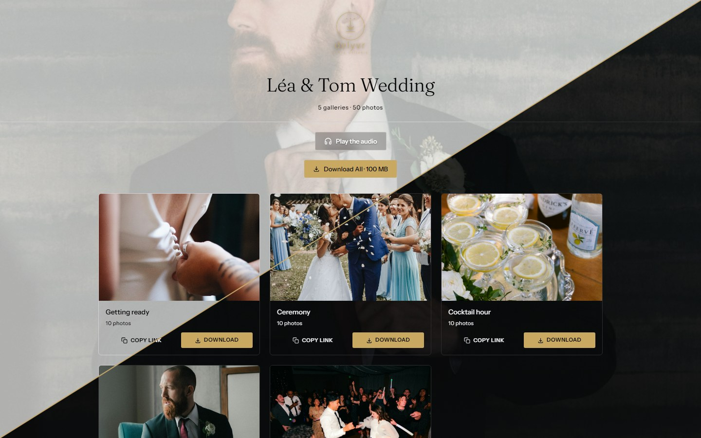
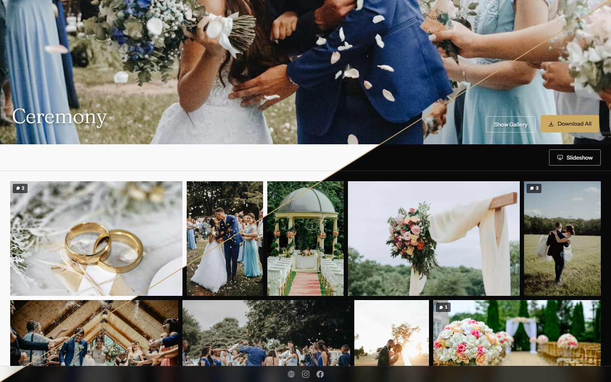
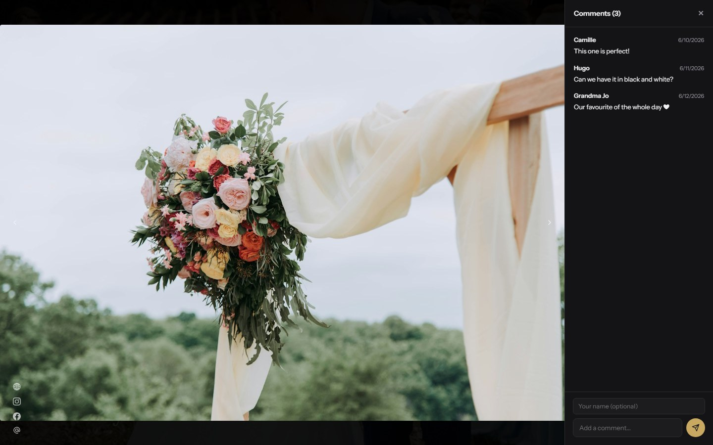
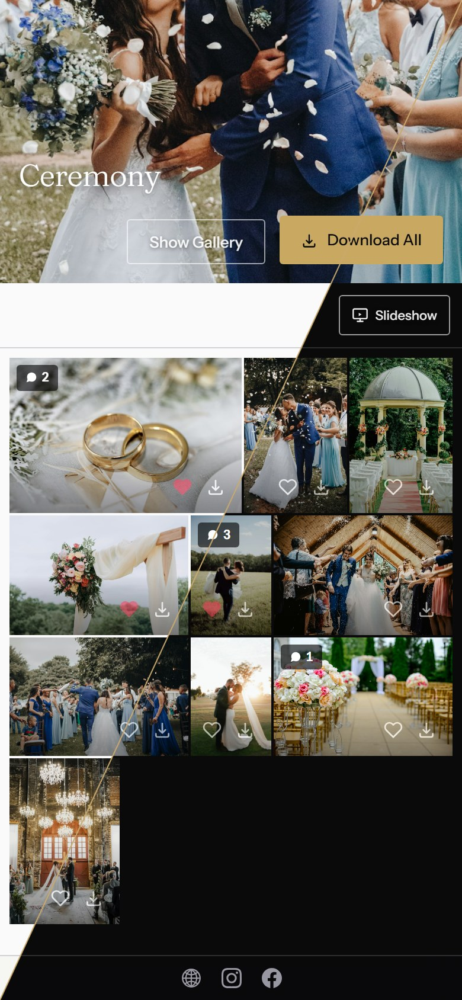
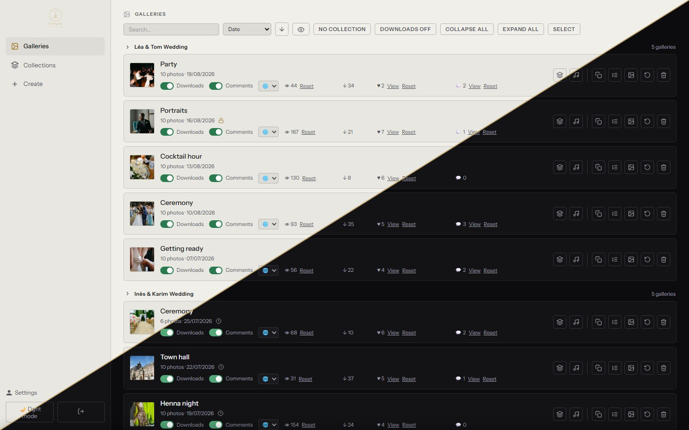
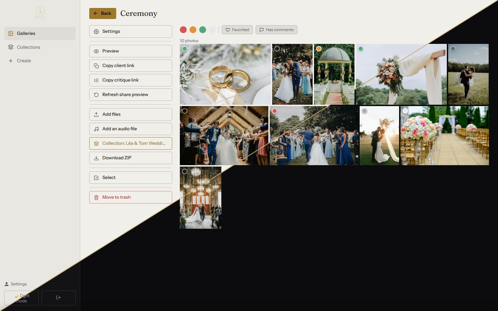
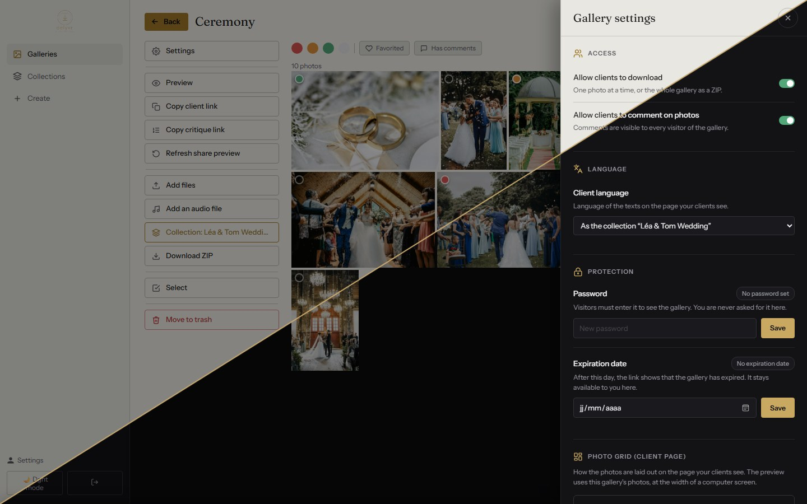
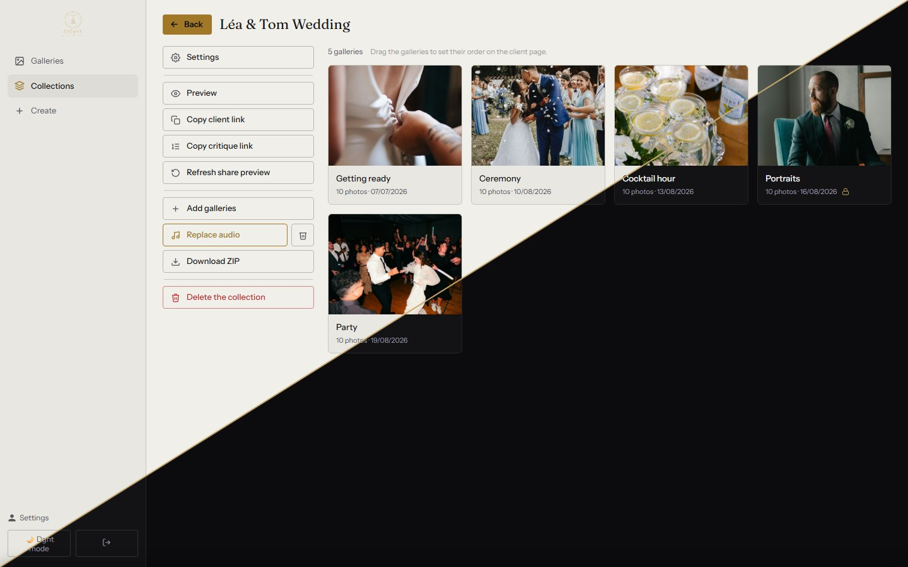

<div align="center">
  

  <p><strong>Self-hosted photo delivery for photographers.</strong><br>
  Upload your photos; your clients get a fast, beautiful gallery to browse, pick favorites and download.</p>

  <p>No subscription · No watermarks · Your server, your brand</p>
</div>

> Based on the original work of [Andre Padua (apadua)](https://github.com/apadua/MeTransfer).

> [!WARNING]
> Built with the help of AI and provided as-is. Reasonable security measures are in place (see [Security](#security)), but no independent audit has been done. Review it before exposing it to the internet.

---

## Screenshots

Light theme on the top left, dark theme on the bottom right (the lightbox is dark in both). Demo content.

<table>
  <tr>
    <td width="50%"></td>
    <td width="50%"></td>
  </tr>
  <tr>
    <td align="center"><sub>Client: a collection</sub></td>
    <td align="center"><sub>Client: a gallery</sub></td>
  </tr>
  <tr>
    <td></td>
    <td align="center"></td>
  </tr>
  <tr>
    <td align="center"><sub>Client: lightbox and comments</sub></td>
    <td align="center"><sub>Client: on a phone</sub></td>
  </tr>
  <tr>
    <td></td>
    <td></td>
  </tr>
  <tr>
    <td align="center"><sub>Admin: all galleries, grouped by collection</sub></td>
    <td align="center"><sub>Admin: a gallery's page</sub></td>
  </tr>
  <tr>
    <td></td>
    <td></td>
  </tr>
  <tr>
    <td align="center"><sub>Admin: gallery settings</sub></td>
    <td align="center"><sub>Admin: a collection's page</sub></td>
  </tr>
</table>

---

## Features

### For your clients

- **Gallery** with a full-screen cover and a justified photo grid (or masonry, square, single column).
- **Lightbox** with keyboard navigation, and swipe and pinch-to-zoom on phones.
- **Favorites**: each visitor hearts their picks, anonymously.
- **Comments** on each photo, guestbook style (can be turned off).
- **Downloads**: one photo or the whole gallery as a ZIP.
- **Slideshow**, full screen, with fade, slide or Ken Burns transitions.
- **Collections**: one link for a whole event, its galleries and one ZIP for everything.
- **Audio montage** for a collection or a gallery, playing without a break as they move between galleries, and included in the ZIP.
- **Videos and animated GIFs** play in the lightbox.
- **Five languages** (English, French, Spanish, Portuguese, Italian), automatic or set per gallery or collection.
- **Your logo, favicon and social links** on every page.

### For you

- **Upload** photos or whole folders by drag and drop; several folders at once create several galleries. Uploads keep running while you work, and can be cancelled.
- **One page per gallery and per collection**, with every action in one place.
- **Culling flags** (red, orange, green, white) and filters by flag, favorite or comment.
- **Settings per gallery**: downloads, comments, language, password, expiration date, photo grid. A collection gives its galleries their defaults; each gallery can override them.
- **Password and expiration** on a gallery or a whole collection.
- **Stats**: views, downloads, favorites (ranking page and CSV export), comments.
- **Critique links** that number every photo, for reviews with other photographers.
- **Share previews** (1200×630) generated for WhatsApp, iMessage and social networks.
- **Trash** kept for 3 days, and bulk actions on several galleries.
- **Color profiles** (Adobe RGB, Display P3) preserved in every thumbnail and preview.
- **Light and dark themes**, admin in five languages.

---

## Quick start (Docker Compose)

**1. `docker-compose.yml`**

```yaml
services:
  delyvr:
    image: tiritibambix/delyvr:main-latest
    restart: unless-stopped
    ports:
      - "${PORT:-3000}:3000"
    environment:
      - INSTALL_DIR=/data
      - ADMIN_PASSWORD=${ADMIN_PASSWORD}
      - TRUST_PROXY=${TRUST_PROXY:-1}
    volumes:
      - ${GALLERY_DIR:-./data}:/data
```

**2. `.env`** next to it

```bash
ADMIN_PASSWORD=a_long_random_string_here
GALLERY_DIR=./data
```

**3. Create the database** (once, before the first start)

```bash
docker compose run --rm delyvr npm run migrate
```

**4. Start**

```bash
docker compose up -d
```

Delyvr runs at `http://localhost:3000`. Everything is stored in `./data/`.

### Updating

```bash
docker compose pull && docker compose up -d
```

Database changes apply themselves on restart.

> [!CAUTION]
> Never run `npm run migrate -- --force` to update: it rebuilds the database from the old JSON files and loses everything since (favorites, comments, new galleries). Back up `./data/` first if you ever need it.

---

## Configuration

| Variable | Default | |
|---|---|---|
| `ADMIN_PASSWORD` | *(required)* | Admin password. Use a long random string. |
| `PORT` | `3000` | Port the server listens on |
| `MAX_UPLOAD_MB` | `200` | Max size per photo |
| `MAX_VIDEO_MB` | `500` | Max size per video |
| `MAX_BACKGROUND_MB` | `25` | Max size per cover image |
| `MAX_AUDIO_MB` | `150` | Max size per audio montage |
| `INSTALL_DIR` | *(project dir)* | `/data` in Docker; leave it |
| `TRUST_PROXY` | `0` | `1` behind a reverse proxy, so rate limits see real visitor IPs |
| `ADMIN_ALLOWED_IPS` | *(unset)* | IPs or CIDR ranges allowed on the admin, e.g. `88.123.45.67,192.168.1.0/24` |

### Behind a reverse proxy

Terminate HTTPS at your proxy, set `TRUST_PROXY=1`, and allow large uploads. For Nginx:

```nginx
location / {
    proxy_pass http://localhost:3000;
    proxy_set_header Host $host;
    proxy_set_header X-Forwarded-For $proxy_add_x_forwarded_for;
    proxy_set_header X-Forwarded-Proto $scheme;
    client_max_body_size 500M;
    proxy_read_timeout 300;
}
```

<details>
<summary><strong>Installation without Docker</strong></summary>

Requires Node.js 22 or newer.

```bash
git clone https://github.com/tiritibambix/delyvr.git && cd delyvr
npm install
cp .env.example .env    # then set ADMIN_PASSWORD
npm run migrate         # once
npm start
```

To keep it running: `npm install -g pm2 && pm2 start server.js --name delyvr && pm2 save`.
</details>

---

## Security

- Admin login rate-limited (10 attempts per 15 minutes), session in an HTTP-only cookie, optional IP allowlist. Failures are logged with an `[AUTH]` prefix (`docker logs delyvr`).
- Every route is rate-limited; every file path is checked to stay inside the data folder; IDs and filenames are validated.
- Gallery and collection passwords are hashed with scrypt; unlock cookies are signed.
- Gallery links are unguessable but public by default: anyone holding the link can view it, unless you set a password.
- HTTPS is up to your reverse proxy.

---

## Troubleshooting

| Problem | Fix |
|---|---|
| "SQLite database not found" at startup | Run `docker compose run --rm delyvr npm run migrate` once, then start again. |
| "ADMIN_PASSWORD is not set" | Set it in `.env` or the compose file. |
| Nginx answers 413 on upload | Add `client_max_body_size 500M;` and reload Nginx. |
| Large ZIP downloads time out | Add `proxy_read_timeout 300;` to the proxy, or split the gallery. |
| Admin blocked unexpectedly | Check `docker logs delyvr` for `[AUTH]` lines; fix `ADMIN_ALLOWED_IPS`. |
| Every visitor shares one rate limit | Set `TRUST_PROXY` and check the proxy sends `X-Forwarded-For`. |

---

## License

MIT. Free to use and modify for your photography business.
